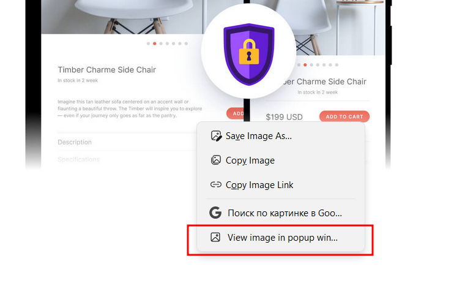

## ⚠️ This project is closed now, and most features are merged into [Open in Popup Window](https://github.com/emvaized/open-in-popup-window-extension) extension. Please feel free to switch! ⚠️

This extension was created to provide ability to quickly view images without leaving the current page context. It adds entry in context menu of links, and when clicked, opens new small window at mouse position without browser controls.

Privacy:
This extension doesn't collect any private data. It requires access to currently open page in order to get mouse coordinates when context menu was opened.

